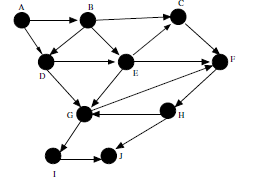

5-2. Do a topological sort of the following graph G: 
(see book for figure)

**ANSWER**

  

  [Answer Here](../../Ch05_Answers/AnswersToQuestions/AQ_02_TopologicalSort_01.cs)

  Summary

  A topological sort is where For every directed edge uv from vertex u to vertex v, u comes before v in the ordering.

  - TopSort can be done with a DFS algorithm where the last child that is found with no more children will be the first item in a stack and then recurses adding to the stack the last node which has not yet been visited till there are no more nodes to add. 
    - Create a TopSort method with a stack for the result and a hash set for visited nodes.
	- For each node in the graph
	  - If the node has not been visited then call the TopSortUtil method (the recursive method)
	    - First step of the recursive method is to add the current node in the visited list
		- For each child in the adjacent list of the current node
		  - If the child has not been visited recurse the TopSortUtil passing in the child
		- Insert the node into the stack (not the child - this should be outside the foreach loop)

  

