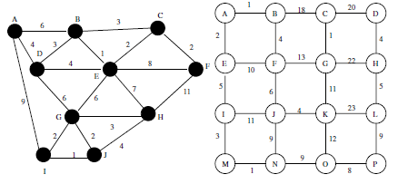

5-1. For the following graphs G1 (left) and G2 (right): 
(see book for figure) 
(see book for figure)

(a) Report the order of the vertices encountered on a breadth-first search starting from vertex A. Break all ties by picking the vertices in alphabetical order (i.e., A before Z).

(b) Report the order of the vertices encountered on a depth-first search starting from vertex A. Break all ties by picking the vertices in alphabetical order (i.e., A before Z).

**ANSWER**

  

  (a) BFS:

- Graph G1: A, B, D, I, C, E, G, J, F, H
- Graph G2: A, B, E, C, F, I, D, G, J, M, H, K, N, L, O, P

(b) DFS:

- Graph G1: A, B, C, E, D, G, H, F, J, I
- Graph G2: A, B, C, D, H, G, F, E, I, J, K, L, P, O, N, M

  

---

5-2. Do a topological sort of the following graph G: 
(see book for figure)

**ANSWER**

  

  [Answer Here](../../Ch05_Answers/AnswersToQuestions/AQ_02_TopologicalSort_01.cs)

  

---

