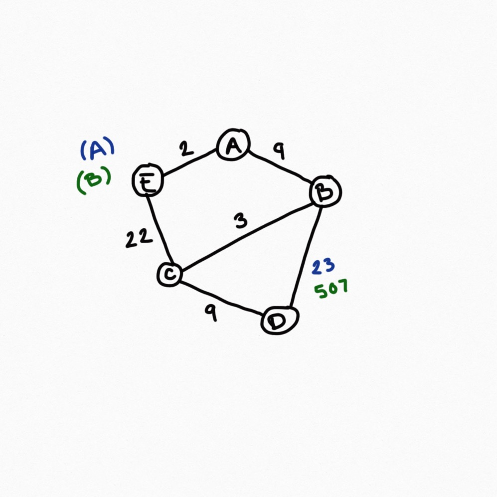

6-15. Let G=(V,E) be an undirected weighted graph, and let T be the shortest-path spanning tree rooted at a vertex v. Suppose now that all the edge weights in G are increased by a constant number k. Is T still the shortest-path spanning tree from v?

**ANSWER**

  

  No. The sum of multiple edges could outweight another path with shorter edges. 

  

  

